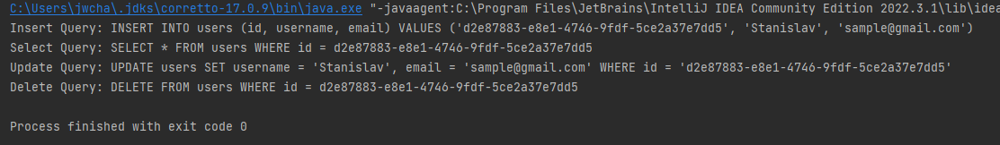

## Дополнительная задача:

* Доработайте метод генерации запроса на удаление объекта из таблицы БД
(DELETE FROM TableName WHERE ID = '<id>')
В классе QueryBuilder который мы разработали на семинаре.

